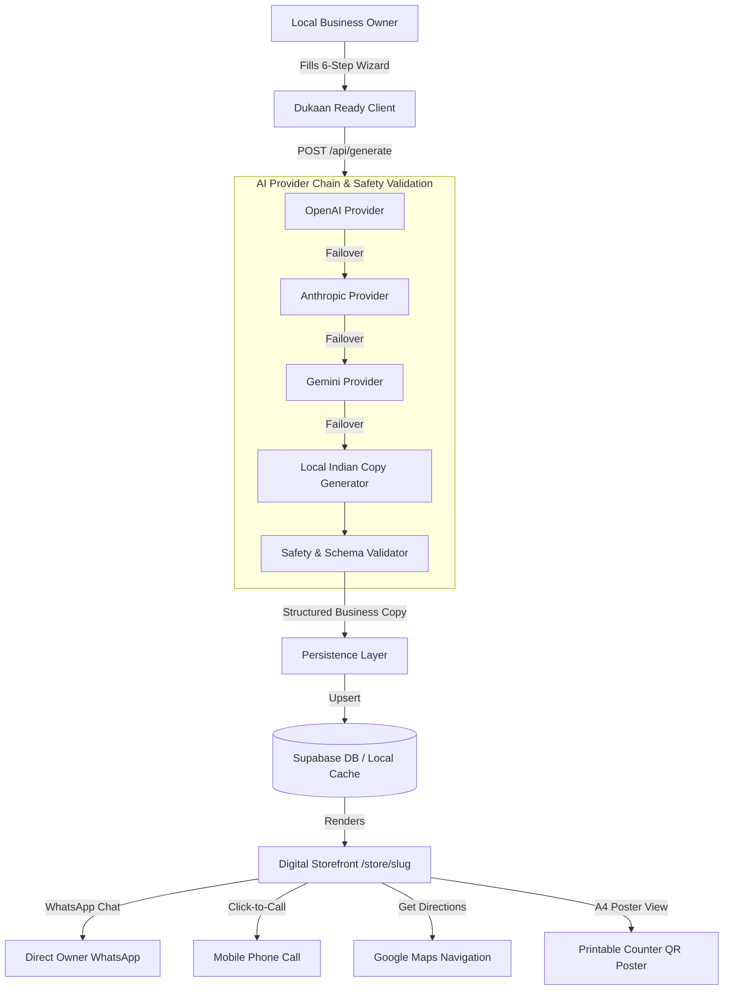

# 🏪 Dukaan Ready

> **Take your local business online in 2 minutes.**
> An instant AI-powered digital storefront platform for India's micro-businesses — no coding, no designer, no technical knowledge required.

Developed for **Hack Devengers 2.0**.

---

## 📌 Problem

Over **63 million micro-businesses** in India — tailors, tuition tutors, mechanics, home kitchens, salons, family clinics, and repair shops — rely entirely on foot traffic and word-of-mouth. Creating a traditional website requires:
- High cost for domain, hosting, and web designers
- Technical knowledge they don't possess
- Complex admin dashboards that are unusable on low-end smartphones
- English-only interfaces that create a language barrier

As a result, millions of local shopkeepers remain invisible on Google Maps, WhatsApp, and social media.

---

## 💡 Solution: Dukaan Ready

**Dukaan Ready** eliminates all barriers by transforming simple business details into a full-featured, mobile-first digital storefront in under 120 seconds.

Owners simply answer a few basic questions in **English, Hindi, or Marathi**. Our intelligent AI engine writes compelling copy, structures service offerings, applies a visual theme, and generates a **shareable URL + printable A4 QR code poster** for their shop counter.

---

## 🚀 Key Features

- **🧙 6-Step Storefront Wizard**: Intuitive mobile-first flow (Business Basics ➔ Offerings ➔ Contact/Location ➔ Operating Hours ➔ Branding & Theme ➔ Live Preview).
- **🤖 Server-Side Multi-Provider AI**: Seamless failover across OpenAI (`gpt-4o-mini`), Anthropic (`claude-3-haiku`), Google Gemini (`gemini-1.5-flash`), and an **Intelligent Localized Indian Copy Engine**.
- **🛡️ AI Content Safety Engine**: Strict sanitization ensuring zero hallucinated certifications, medical recovery claims, fake reviews, or unsupplied prices.
- **🎨 Category Personalization & Themes**: Adapts UI layouts for Auto Garages, Tuition Centers, Home Kitchens, Tailors, Clinics, and Salons across 5 themes (`Terracotta`, `Mustard`, `Forest`, `Clean`, `Warm`).
- **💬 Direct WhatsApp Lead Generation**: One-click WhatsApp chat buttons with pre-filled, item-specific inquiry messages (e.g. *"Hi, I would like to inquire about your Bike Servicing package"*).
- **📞 Call & Google Maps Navigation**: Direct `tel:` calling and instant Google Maps directions search.
- **🖨️ Printable A4 Shop Counter Poster**: Dedicated printable A4 poster view (`/store/[slug]/poster`) featuring a large QR code for counter placement.
- **🌐 Multilingual Support**: Language switching across English, Hindi (हिन्दी), and Marathi (मराठी).
- **💾 Dual Persistence Layer**: Production **Supabase** database integration with automatic local fallback for offline development.

---

## 🏗️ Architecture



---

## 🛠️ Tech Stack

- **Framework**: [Next.js 16 (App Router)](https://nextjs.org/)
- **UI & Logic**: [React 19](https://react.dev/), TypeScript, [Tailwind CSS v4](https://tailwindcss.com/)
- **Icons**: [Lucide React](https://lucide.dev/)
- **QR Engine**: `qrcode.react`
- **Celebration Effects**: `canvas-confetti`
- **Database / Backend**: [Supabase](https://supabase.com/) JS Client (with serverless JSON/memory fallback)
- **AI Providers**: OpenAI API, Anthropic Messages API, Google Gemini API

---

## 🔑 Environment Variables

Copy `.env.example` to `.env.local`:

```bash
cp .env.example .env.local
```

Required variables:

```env
# AI API Keys (Optional - provider manager falls back to localized engine if empty)
OPENAI_API_KEY=
ANTHROPIC_API_KEY=
GEMINI_API_KEY=

# Supabase Storage (Optional - defaults to local storage if empty)
NEXT_PUBLIC_SUPABASE_URL=
NEXT_PUBLIC_SUPABASE_ANON_KEY=
SUPABASE_SERVICE_ROLE_KEY=

# Base URL
NEXT_PUBLIC_APP_URL=http://localhost:3000
```

---

## 💻 Running Locally

1. **Clone the repository**:
   ```bash
   git clone https://github.com/avi221209/Hack-Devengers-2.0.git
   cd Hack-Devengers-2.0
   ```

2. **Install dependencies**:
   ```bash
   npm install
   ```

3. **Start development server**:
   ```bash
   npm run dev
   ```
   Open [http://localhost:3000](http://localhost:3000) in your browser.

4. **Production Build**:
   ```bash
   npm run build
   npm start
   ```

---

## 🏆 Hackathon Context

Built for **Hack Devengers 2.0**. Designed to empower millions of micro-entrepreneurs across Digital India with zero technical barriers.
