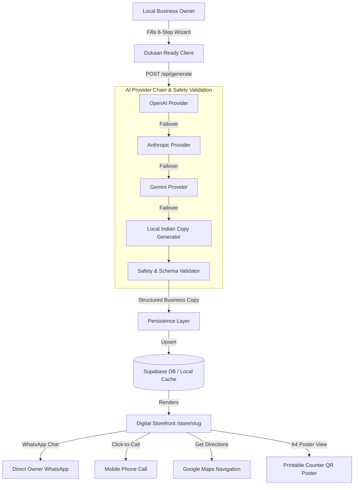

# 🏪 Dukaan Ready

> **Take your local business online in 2 minutes.**
> An instant AI-powered digital storefront platform for India's micro-businesses — no coding, no designer, no technical knowledge required.

Developed for **Hack Devengers 2.0**.

---

## 🌐 Live Demo & Instant Sample Links

* **Live Platform Application**: [https://dukaan-ready.netlify.app](https://dukaan-ready.netlify.app)
* **Sample Auto Garage Storefront**: [https://dukaan-ready.netlify.app/store/sai-krupa-auto-garage](https://dukaan-ready.netlify.app/store/sai-krupa-auto-garage)
* **Sample Tailoring & Boutique Storefront**: [https://dukaan-ready.netlify.app/store/shree-ganesh-tailors-pune](https://dukaan-ready.netlify.app/store/shree-ganesh-tailors-pune)
* **Sample Home Kitchen & Tiffin Storefront**: [https://dukaan-ready.netlify.app/store/aais-home-kitchen](https://dukaan-ready.netlify.app/store/aais-home-kitchen)
* **Sample Tuition Center Storefront**: [https://dukaan-ready.netlify.app/store/bright-future-classes](https://dukaan-ready.netlify.app/store/bright-future-classes)

---

## 📸 Platform Screenshots & Walkthrough

| 1. Landing Page (Indian Bazaar Theme) | 2. Side-by-Side Create Wizard |
|:---:|:---:|
| Hero section with category carousel & WhatsApp chat bubble testimonials | Real-time live updating preview panel as user types |

| 3. Generated Digital Storefront | 4. Printable A4 Shop Counter Poster |
|:---:|:---:|
| Overlapping header banner, trust pills, & pulsing WhatsApp conversion bar | Dedicated counter poster view with QR code for shop display |

---

## 📌 Problem

Over **63 million micro-businesses** in India — tailors, tuition tutors, mechanics, home kitchens, salons, family clinics, and repair shops — rely entirely on foot traffic and word-of-mouth. Creating a traditional website requires:
- High cost for domain, hosting, and web designers
- Technical knowledge they don't possess
- Complex admin dashboards that are unusable on low-end smartphones
- English-only interfaces that create a language barrier

As a result, millions of local shopkeepers remain invisible on Google Maps, WhatsApp, and social media.

---

## 💡 Solution: Dukaan Ready

**Dukaan Ready** eliminates all barriers by transforming simple business details into a full-featured, mobile-first digital storefront in under 120 seconds.

Owners simply answer a few basic questions in **English, Hindi, or Marathi**. Our intelligent AI engine writes compelling copy, structures service offerings, applies a visual theme, and generates a **shareable URL + printable A4 QR code poster** for their shop counter.

---

## 🚀 Key Features

- **🧙 6-Step Storefront Wizard**: Intuitive mobile-first flow (Business Basics ➔ Offerings ➔ Contact/Location ➔ Operating Hours ➔ Branding & Theme ➔ Live Preview) with a persistent progress bar.
- **👁️ Live-Updating Preview Panel**: Side-by-side desktop panel & mobile view toggle showing their storefront forming in real time as they type.
- **🤖 Server-Side Multi-Provider AI**: Seamless failover across OpenAI (`gpt-4o-mini`), Anthropic (`claude-3-haiku`), Google Gemini (`gemini-1.5-flash`), and an **Intelligent Localized Indian Copy Engine**.
- **🛡️ AI Content Safety Engine**: Strict sanitization ensuring zero hallucinated certifications, medical recovery claims, fake reviews, or unsupplied prices.
- **🎨 Category Personalization & Themes**: Adapts UI layouts for Auto Garages, Tuition Centers, Home Kitchens, Tailors, Clinics, and Salons across 5 themes (`Terracotta`, `Mustard`, `Forest`, `Clean`, `Warm`).
- **💬 Direct WhatsApp Lead Generation**: One-click WhatsApp chat buttons with pre-filled, item-specific inquiry messages (e.g. *"Hi, I would like to inquire about your Bike Servicing package"*).
- **📞 Call & Google Maps Navigation**: Direct `tel:` calling and instant Google Maps directions search.
- **🖨️ Printable A4 Shop Counter Poster**: Dedicated printable A4 poster view (`/store/[slug]/poster`) featuring a large QR code for counter placement.
- **🌐 Multilingual Support**: Language switching across English, Hindi (हिन्दी), and Marathi (मराठी).
- **💾 Dual Persistence Layer**: Production **Supabase** database integration with automatic local fallback for offline development.

---

## 🧪 Automated Testing Suite

The repository includes a comprehensive automated test suite spanning unit tests, component tests, and full Playwright end-to-end (E2E) browser tests.

### Running Tests

```bash
# Run Unit & Component Tests (Jest + React Testing Library)
npm run test

# Run End-to-End Browser Tests (Playwright)
npm run test:e2e
```

### Test Suite Coverage

| Test Type | File | Coverage / Scope | Status |
|:---|:---|:---|:---:|
| **Unit Tests** | `tests/unit/validation.test.ts` | Clean slug generation (diacritics, special chars, fallbacks), Indian phone number normalization (`+91`, `0` prefix, validation), input validation rules | ✅ PASS |
| **Unit Tests** | `tests/unit/aiFailover.test.ts` | AI Provider Failover Chain — verifies graceful fallback from OpenAI ➔ Anthropic ➔ Gemini ➔ Local Indian Heuristic Engine without throwing unhandled exceptions | ✅ PASS |
| **Component Tests** | `tests/component/wizardAndWhatsapp.test.tsx` | WizardSteps step calculation & percentage bar rendering, language dictionary translations (EN, HI, MR), `wa.me` URL message encoding | ✅ PASS |
| **E2E Tests** | `tests/e2e/e2eFlow.spec.ts` | **Full Happy Path**: Complete intake wizard, storefront generation, visible title/tagline, WhatsApp link construction, QR modal interaction, phone search lookup on `/my-storefronts` | ✅ PASS |
| **E2E Regression Test** | `tests/e2e/e2eFlow.spec.ts` | **Phase 1 Bug Fix Regression**: Requests nonexistent slug (`/store/non-existent-slug`) and asserts clean "Storefront Not Found" UI within 5 seconds instead of an infinite loading spinner | ✅ PASS |

---

## 🏗️ Architecture



---

## 🔑 Environment Variables & Failover Checklist

Copy `.env.example` to `.env.local`:

```bash
cp .env.example .env.local
```

### Environment Variable Specification

| Variable Name | Required / Optional | Description & Failover Behavior |
|:---|:---:|:---|
| `OPENAI_API_KEY` | Optional | OpenAI API key (`sk-...`). If omitted or invalid, system automatically tries Anthropic / Gemini / Local Engine. |
| `ANTHROPIC_API_KEY` | Optional | Anthropic API key (`sk-ant-...`). Used in failover chain if OpenAI fails or is unconfigured. |
| `GEMINI_API_KEY` | Optional | Google Gemini API key. Used in failover chain if OpenAI & Anthropic fail or are unconfigured. |
| `NEXT_PUBLIC_SUPABASE_URL` | Optional | Supabase Project URL. If omitted, system defaults seamlessly to local memory/JSON file storage. |
| `NEXT_PUBLIC_SUPABASE_ANON_KEY` | Optional | Supabase Anonymous Client Key. |
| `SUPABASE_SERVICE_ROLE_KEY` | Optional | Supabase Service Role Key for server-side operations. |
| `NEXT_PUBLIC_APP_URL` | Optional | Application base URL (defaults to `http://localhost:3000` or deployment host). |

> **Graceful Degradation Guarantee**: The application contains zero hard dependencies on external API keys or cloud databases. If all remote credentials are missing, Dukaan Ready degrades cleanly to its built-in Indian Local Copy Engine and local filesystem/memory storage with zero runtime crashes.

---

## 🛠️ Tech Stack

- **Framework**: [Next.js 16 (App Router)](https://nextjs.org/)
- **UI & Logic**: [React 19](https://react.dev/), TypeScript, [Tailwind CSS v4](https://tailwindcss.com/)
- **Icons**: [Lucide React](https://lucide.dev/)
- **QR Engine**: `qrcode.react`
- **Celebration Effects**: `canvas-confetti`
- **Testing**: [Jest](https://jestjs.io/), [React Testing Library](https://testing-library.com/), [Playwright](https://playwright.dev/)
- **Database / Backend**: [Supabase](https://supabase.com/) JS Client (with serverless JSON/memory fallback)
- **AI Providers**: OpenAI API, Anthropic Messages API, Google Gemini API

---

## 💻 Running Locally

1. **Clone the repository**:
   ```bash
   git clone https://github.com/avi221209/Hack-Devengers-2.0.git
   cd Hack-Devengers-2.0
   ```

2. **Install dependencies**:
   ```bash
   npm install
   ```

3. **Start development server**:
   ```bash
   npm run dev
   ```
   Open [http://localhost:3000](http://localhost:3000) in your browser.

4. **Run Unit & E2E Tests**:
   ```bash
   npm run test
   npm run test:e2e
   ```

5. **Production Build**:
   ```bash
   npm run build
   npm start
   ```

---

## ⚠️ Known Limitations

1. **AI Generation Keys**: Full generative copy variation requires external API keys (`OPENAI_API_KEY`, `ANTHROPIC_API_KEY`, or `GEMINI_API_KEY`). Without keys, the platform relies on the localized Indian copy engine, which produces high-converting templated copy tailored to each category.
2. **Serverless Filesystem Persistence**: On serverless deployment platforms (e.g. Netlify/Vercel) without Supabase credentials configured, local filesystem storage (`data/businesses.json`) is read-only or ephemeral across deployments. Connecting a free Supabase instance provides permanent cloud database storage.
3. **Browser Print Preview**: The A4 shop poster view (`/store/[slug]/poster`) depends on standard browser print CSS styling (`@media print`). Margins and background graphics may vary depending on mobile printer driver settings.

---

## 🏆 Hackathon Context

Built for **Hack Devengers 2.0**. Designed to empower millions of micro-entrepreneurs across Digital India with zero technical barriers.
